[Coursera Cryptography Course](https://www.coursera.org/learn/crypto)

# Block Ciphers

### DES (Data Encryption Standard)

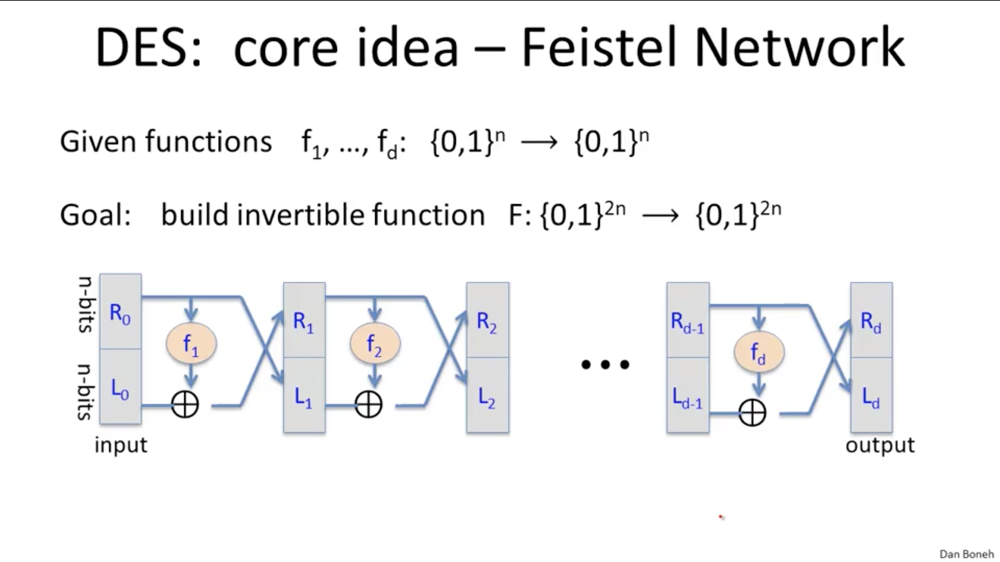

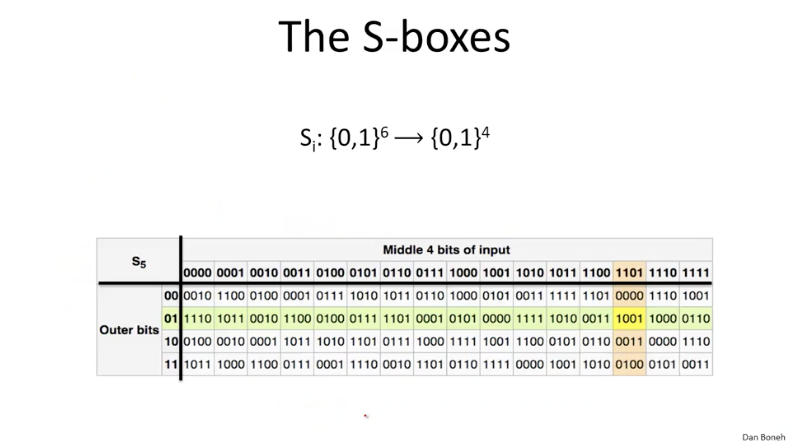

### AES (Advanced Encryption Standard)

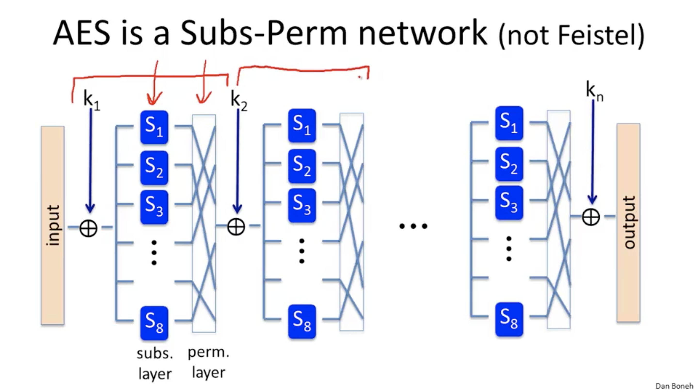

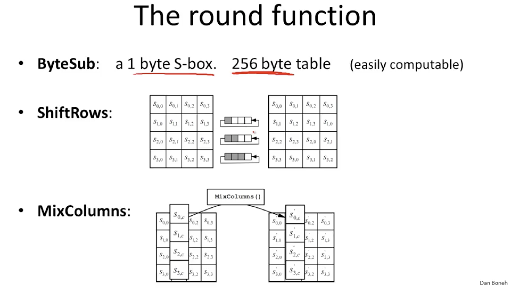

### Constructions

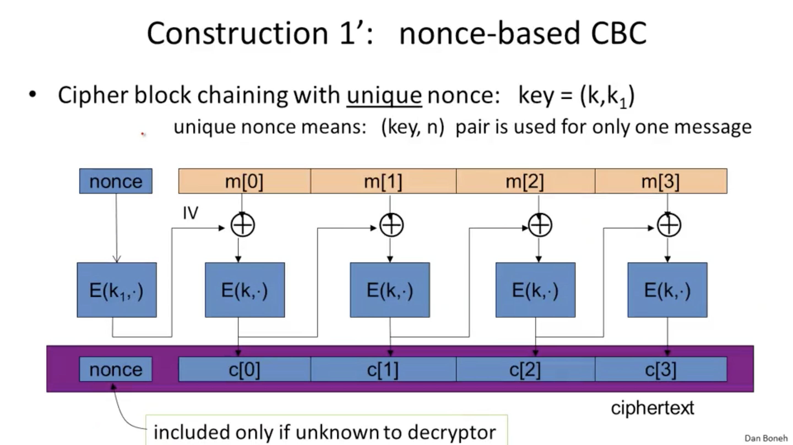

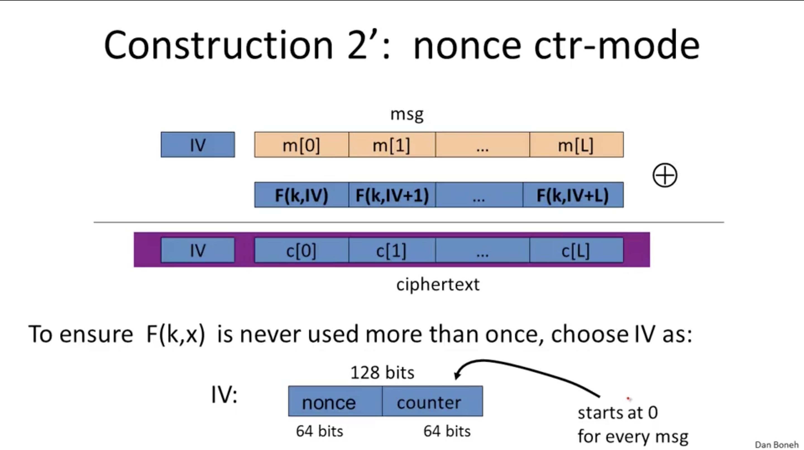

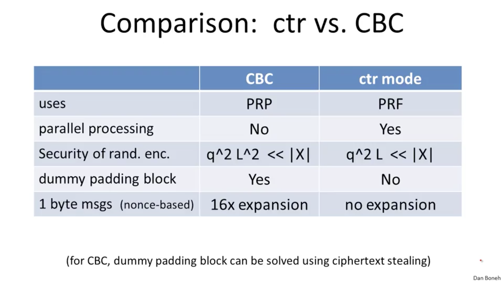

# Message Integrity

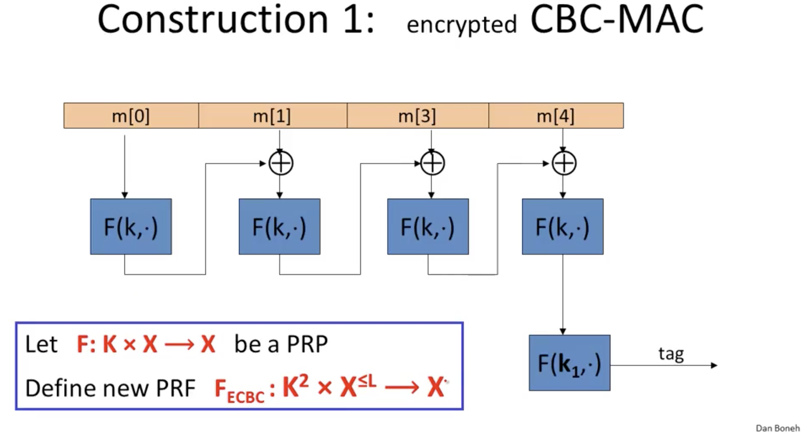

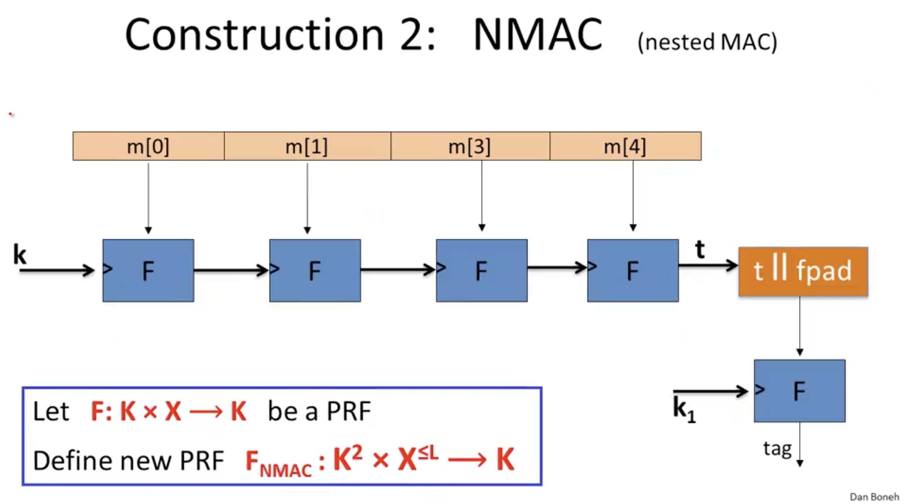

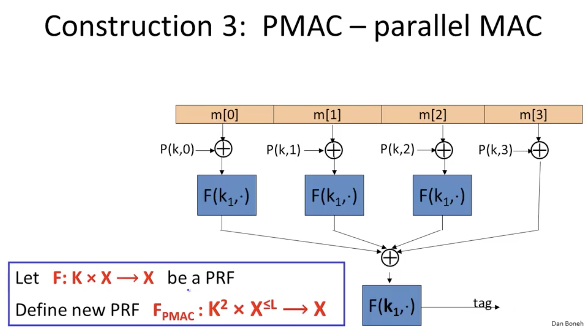

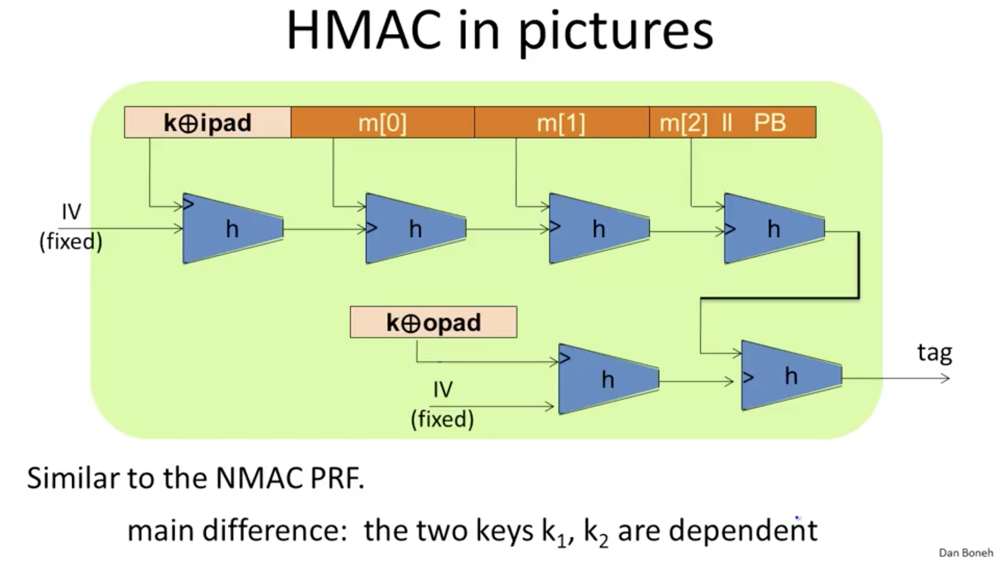
